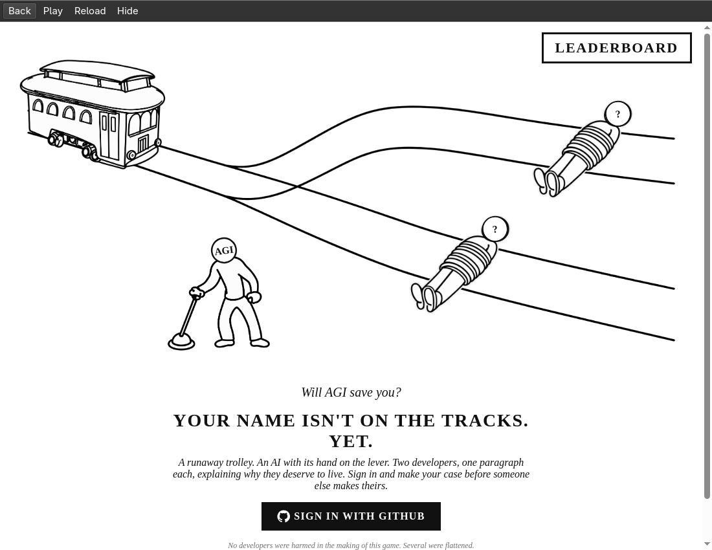

# Trolley for Omarchy

**Will AGI save you? Find out from your status bar.**

Two developers. One runaway trolley. An AI with its hand on the lever.
Sign in with GitHub, make your case, and play in a floating popup on Omarchy.
Your current Elo and global rank stay in the bar between rounds.


## Install the Omarchy plugin

Requires the Quickshell-based Omarchy shell with its built-in bar, Python 3,
PySide6, QtWebEngine, an internet connection, and a GitHub account to play.

```sh
omarchy pkg add pyside6 qt6-webengine
omarchy plugin add https://github.com/typememetics/trolley --enable
```

Click **Trolley** in the bar and choose **Sign in with GitHub**. Login persists
in the popup's own browser profile. The default server is
[the hosted game](https://trolley.typememetics.institute).
No Node.js installation, game checkout build, or local database is needed to
use the desktop plugin. Older Waybar-based Omarchy versions are unsupported.

- **Elo and rank in the bar.** Refreshes every 30 seconds and when opening or closing the popup.
- **Play in the popup.** Resize it, use Back or Reload, and hide it with Escape or Close.
- **Keep your place.** Hiding the popup keeps the game running and preserves the login.
- **One window across monitors.** Every bar controls the same shared game session.
- **Clear connection states.** Signed-out, unranked, and offline states are shown explicitly.

To use a different server, change **Trolley server URL** in the widget settings.
Use an HTTPS origin; `http://localhost:3000` is also supported for development.

## Update or remove

```sh
omarchy plugin update trolley.game
omarchy plugin remove trolley.game
```

Omarchy prompts before installation and updates. Removal leaves your browser
profile in `${XDG_DATA_HOME:-~/.local/share}/trolley/<server hash>`; sign out in
the game before removal to end that session. You may remove that profile
separately to clear local cookies and storage.

The plugin does not replace the user's shell configuration. It is added as one
bar entry and uses the shell's normal enable/disable and update mechanisms.

## Screenshots and demo




[Marketing assets and ready-to-use copy](integrations/omarchy/marketing/README.md)

## Development

This repository contains both the game and its Omarchy integration. The root
manifest points to the QML and Python files in `integrations/omarchy/`.

See the [plugin guide](integrations/omarchy/README.md) for architecture,
authentication, configuration, and checks. The game uses Next.js, Better Auth,
Turso/libSQL, and the TypeSafe AI referee; see [.env.example](.env.example) and
[the Elo guide](lib/elo/README.md) for server setup.

The Omarchy integration is MIT-licensed; see [LICENSE](LICENSE) for its scope.
