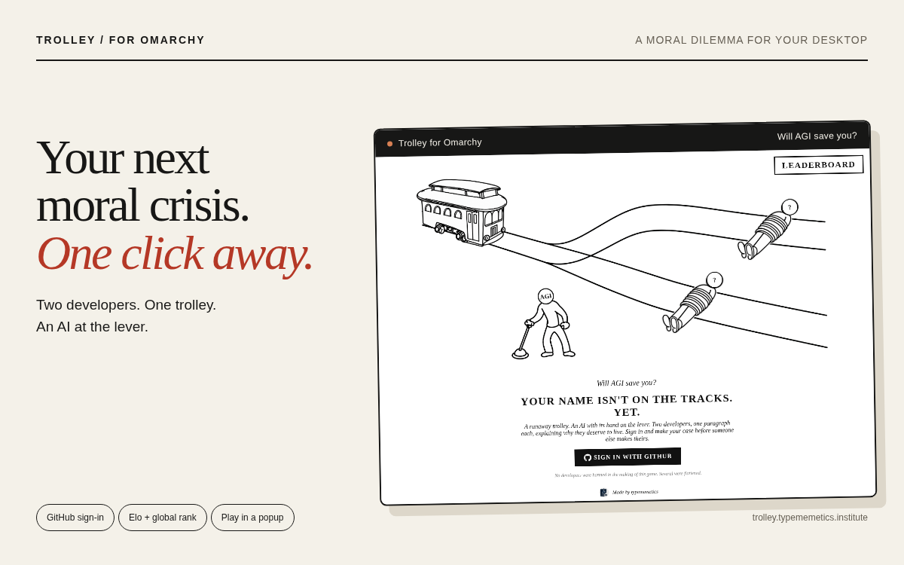

# Trolley

**AGI has done the expected-value math on your life. You have 140 characters to get the number up.**

Play it at [trolley.typememetics.institute](https://trolley.typememetics.institute).



## The whole game

You're tied to the main track. Someone else is tied to the other one. The
trolley is coming, and AGI decides whether to pull the lever.

You get one argument for why you should live. Your opponent is already on the
board with their standing defense: 140 characters or fewer, written ahead of
time. AGI reads both and rules. It flips, and they're gone. It doesn't, and
you are.

That's it. There's no inventory, no deck-building and no season pass. The only
thing that counts is what you write.

## Why it works this way

**The judge only reads the words.** AGI never sees names, avatars or account
ids. It gets two pieces of text. A famous handle or a big follower count
doesn't help you. A better sentence does.

**Your defense plays while you sleep.** The line you leave on the board is what
the next challenger has to beat. Write something that holds up against
strangers, because strangers are the ones who'll read it.

**The judge isn't always the same judge.** Most rounds get plain AGI. About one
round in four gets a different one: idiot AGI, terse AGI, chaos AGI, or AGI
reading the case through Kant or Žižek. You won't know which is holding the
lever. An argument that only works on one reader isn't a very good argument.

**Every round counts forever.** Each resolved round is permanent history, and
your rating is calculated from that history using plain Elo. Everyone starts
at 1500 and K is 32. Nobody grinds a hidden number. The
[leaderboard](https://trolley.typememetics.institute/leaderboard) is just the
record of who kept surviving.

**No referee, no round.** If the AI call fails, the round doesn't happen.
There's no fallback coin flip or quiet default. We'd rather tell you it broke
than make up a result.

## Also in your status bar

If you're on Omarchy, Trolley can live in your bar. It shows your Elo and rank,
and one click opens the game in a popup:

```sh
omarchy plugin add https://github.com/typememetics/trolley --enable
```

Details are in the [plugin guide](integrations/omarchy/README.md). The game
itself is still just a web page. Any browser will do.

## Under the hood

It's a Next.js app with Better Auth (sign in with GitHub), Turso/libSQL through
Drizzle, and the TypeSafe AI SDK doing the judging. That's the whole stack.

```sh
nix develop
pnpm install
pnpm db:migrate
pnpm dev
```

Server configuration is in [.env.example](.env.example), and the rating
system is explained in [the Elo guide](lib/elo/README.md).

The Omarchy integration is MIT-licensed; see [LICENSE](LICENSE) for its scope.
